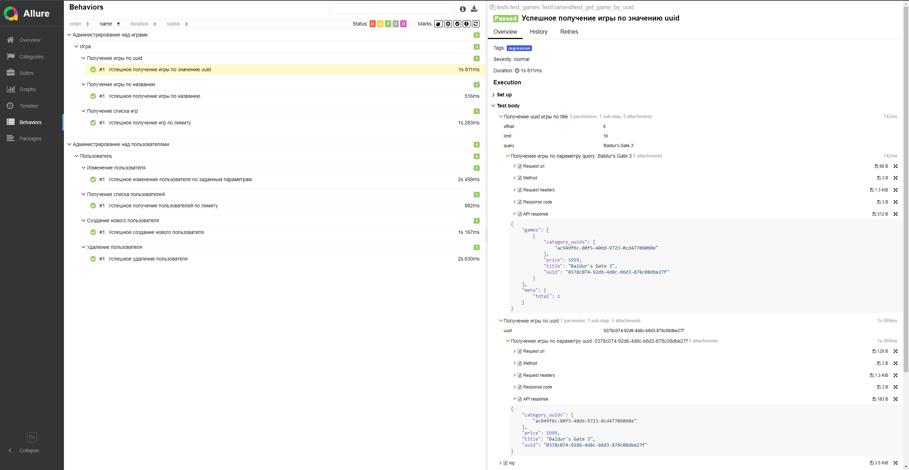
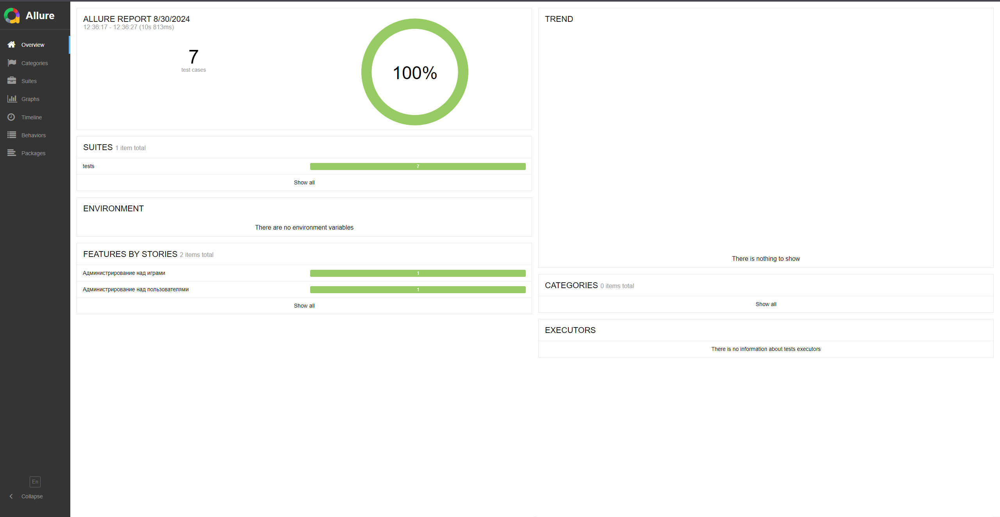
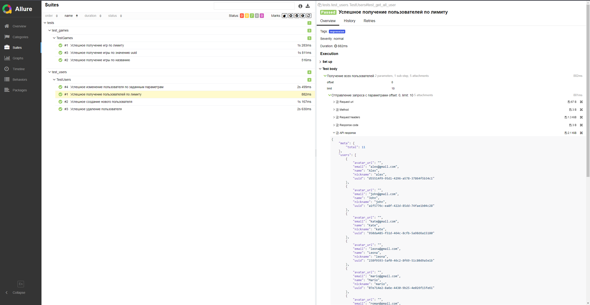

# Дипломный проект QA.GURU (API-тестирование)

Данный репозиторий содержит проект - API тестирование для https://qa-playground.com/ru - часть дипломной работы, выполненной в рамках обучения на курсах QA.GURU.
Проект разработан с целью продемонстрировать полученные навыки и знания в области тестирования программного обеспечения.

## 🛠 Технологии примененные в данном проекте

  
<div>
  <a href="https://www.python.org/" target="_blank" rel="noreferrer"></a>
  <a href="https://git-scm.com/" target="_blank" rel="noreferrer"></a>
  &nbsp
  &nbsp
  &nbsp
  &nbsp
  &nbsp
  &nbsp     
</div>

## Список автоматизированных тест-кейсов:
1. Проверка успешного получения пользователей по заданному лимиту
2. Проверка успешного создания нового пользователя
3. Проверка успешного удаления пользователя
4. Проверка успешного изменения пользователя по заданным параметрам
5. Проверка успешного получения игр по заданному лимиту
6. Проверка успешного получения игры по названию
7. Успешное успешного получения игры по значению uuid

## Запуск тестов и получение отчета

### **Локально**

<details><summary>1. Склонировать репозиторий</summary>

```
git clone https://github.com/Petr-Andreev/qa-playground-project-tests.git
```
</details>

<details><summary>2. Создать и активировать виртуальное окружение, установить зависимости и запустить тесты</summary>

```
python -m venv .venv
source .venv/bin/activate
pip install -r requirements.txt
pytest -sv
```
</details>

<details><summary>3. Получить отчет о прохождении тестов в allure</summary>

```
allure serve allure-results
```
</details>

<details><summary>4. После выполнения команды откроется браузер с отчетом</summary>
    


</details>

## </a>

<details><summary>Основной отчет</summary>



</details>
<details><summary>Тесты</summary>



</details>
